# موقع الشركة المصرية لمهمات المصانع — elmasriasupplies.com

موقع تعريفي متعدد الصفحات (10 صفحات) — HTML/CSS/JS خالص، من غير أي داشبورد أو قواعد بيانات.

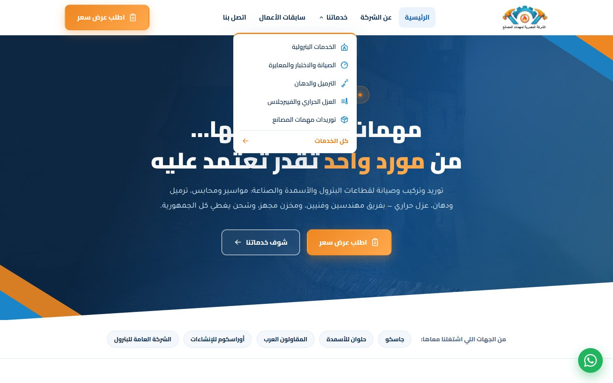

## المميزات

- **10 صفحات** كاملة: رئيسية، عن الشركة، 5 صفحات خدمات، سابقات أعمال، واتصل بنا
- **عربي RTL** بالكامل مع خطوط Cairo و Tajawal
- **Responsive** — قائمة جانبية للموبايل وشبكات مرنة لكل المقاسات
- **صفر مكتبات خارجية** — مفيش jQuery ولا Bootstrap ولا build step؛ HTML و CSS و JS خام
- **أيقونات SVG inline** — من غير أي ملف أيقونات أو طلبات شبكة زيادة
- **حركات عند التمرير** بـ IntersectionObserver + عدّادات متحركة
- **فورم عرض سعر** بيحوّل البيانات لرسالة واتساب جاهزة
- **SEO كامل** — Schema.org و Open Graph و canonical و sitemap

## معاينة

### الموبايل

| القائمة الجانبية | الرئيسية | خدماتنا |
|:---:|:---:|:---:|
| 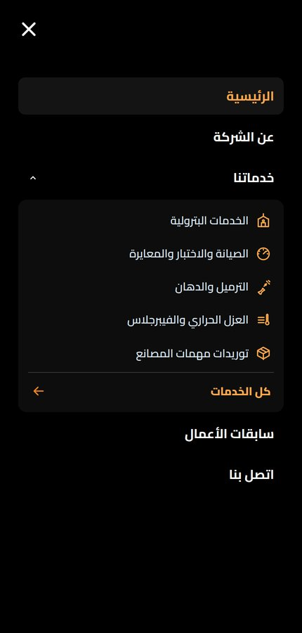 | 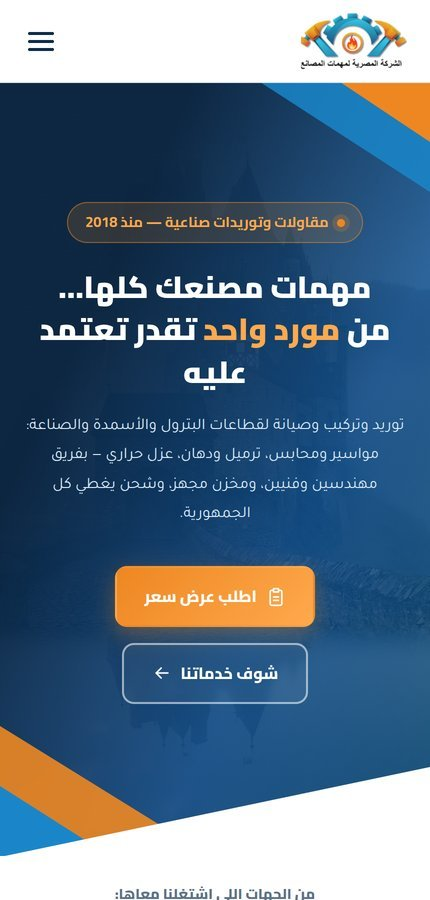 | 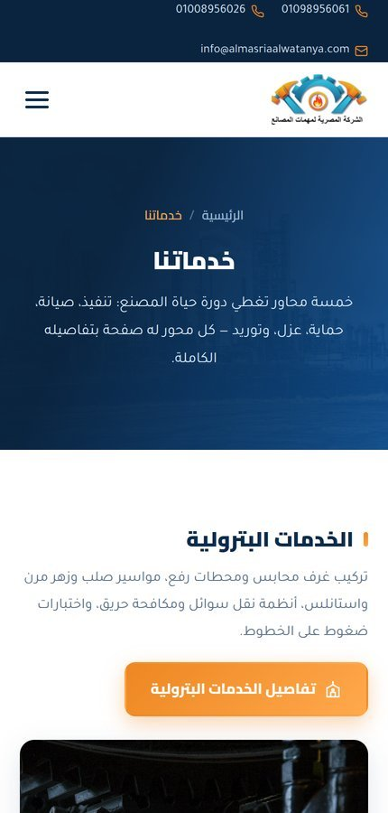 |

### كل الصفحات

<details>
<summary><b>افتح معرض الصفحات العشرة (لقطات كاملة)</b></summary>

#### الرئيسية
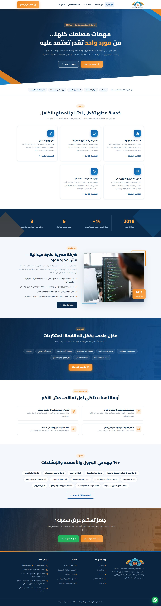

#### عن الشركة
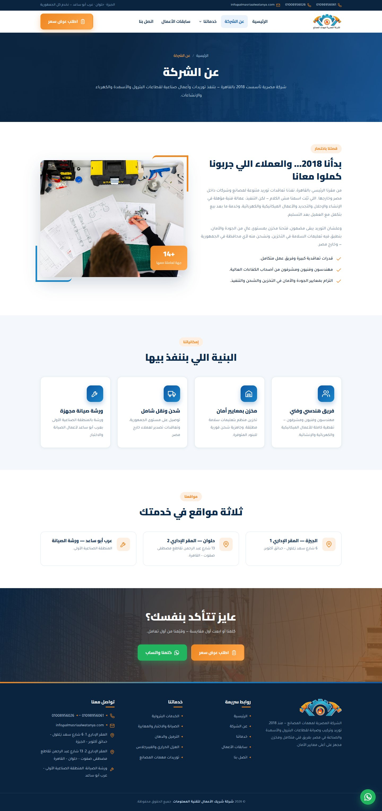

#### خدماتنا
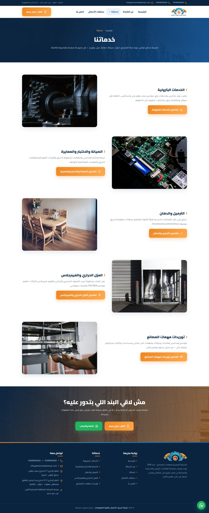

#### الخدمات البترولية
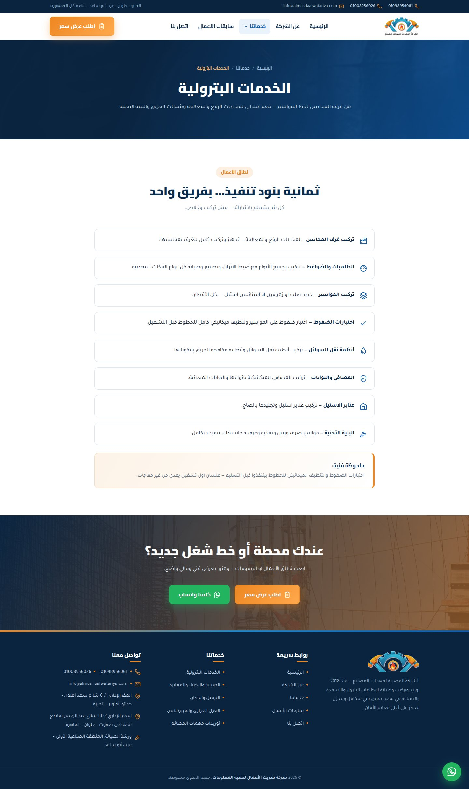

#### الصيانة والاختبار والمعايرة
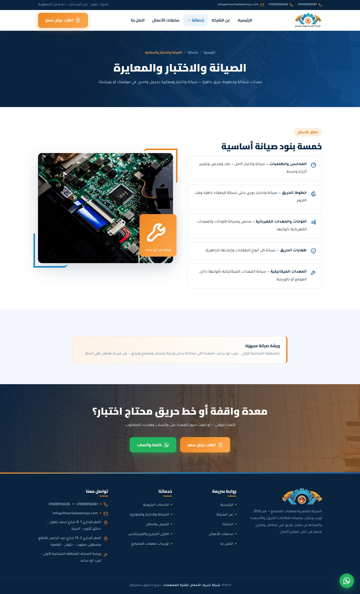

#### الترميل والدهان
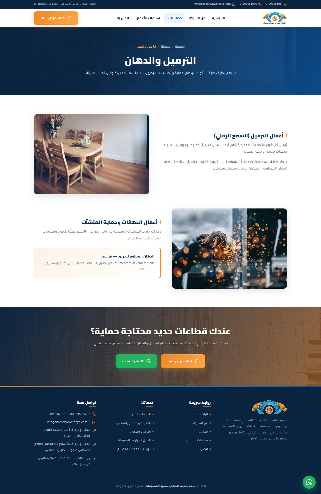

#### العزل الحراري والفيبرجلاس
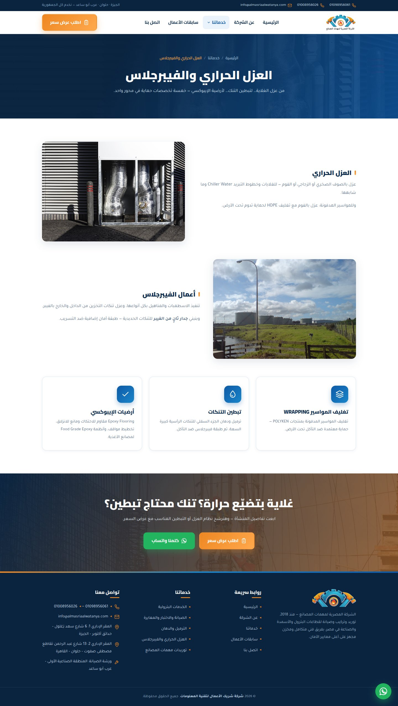

#### توريدات مهمات المصانع
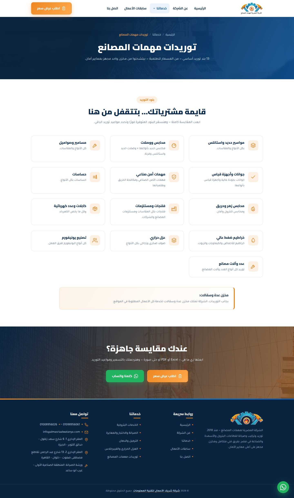

#### سابقات الأعمال
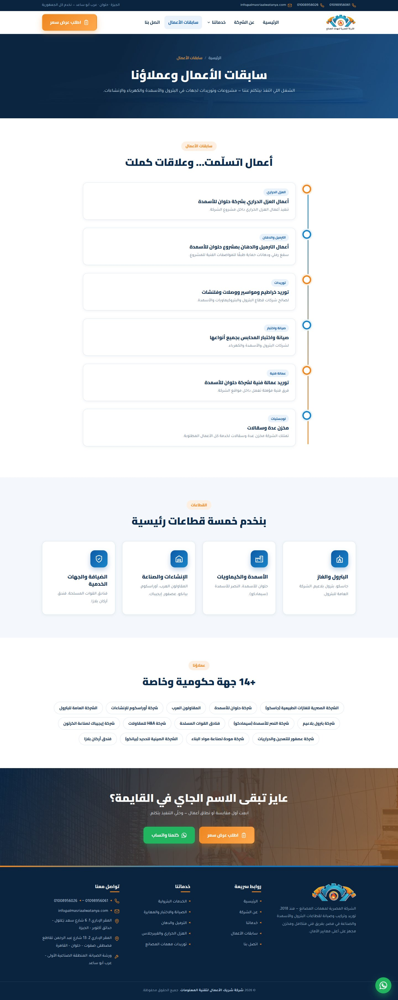

#### اتصل بنا
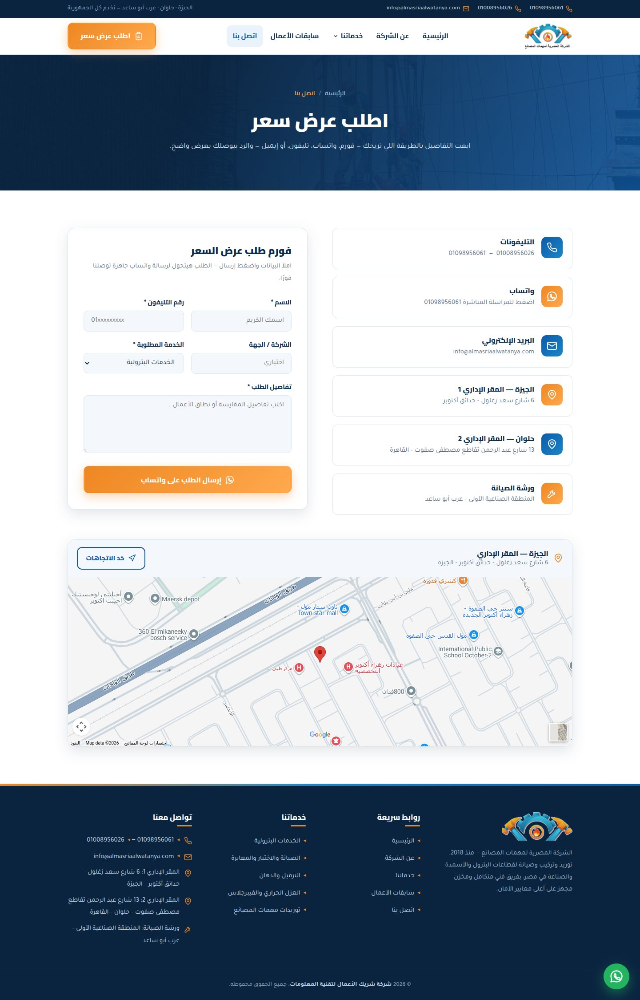

</details>

## التشغيل محليًا

الموقع static بالكامل — يكفي تفتح `index.html` في المتصفح مباشرة، أو تشغّل سيرفر محلي:

```bash
python3 -m http.server 8000
# افتح http://localhost:8000
```

## قبل أي رفع للسيرفر

السيرفر بيبعت `cache-control: max-age=604800` (7 أيام) لملفات CSS/JS، فمن غير
رقم إصدار في الرابط أي تعديل هيفضل مش ظاهر للزوار الراجعين لحد أسبوع.
شغّل السكربت ده قبل الرفع — بيحط بصمة MD5 على روابط الأصول في كل الصفحات:

```bash
./stamp-assets.sh
```

## محتويات المجلد
- `index.html` + 9 صفحات داخلية
- `assets/css/style.css` — التصميم كله
- `assets/js/main.js` — القائمة والحركات وفورم الواتساب
- `assets/img/` — الصور واللوجو والأيقونات (CREDITS.txt فيه مصادر الصور)
- `sitemap.xml` + `robots.txt` — جاهزين للأرشفة

## خطوات الرفع (أي استضافة static)
1. ارفع محتويات المجلد كله في `public_html` (أو root الاستضافة).
2. اربط الدومين `elmasriasupplies.com` بالاستضافة وفعّل شهادة SSL (Let's Encrypt مجانية).
3. اتأكد إن الموقع بيفتح على `https://elmasriasupplies.com`.

## أرشفة جوجل (Google Search Console)
1. ادخل على search.google.com/search-console وأضف الدومين `elmasriasupplies.com` (نوع Domain).
2. أثبت الملكية عن طريق سجل TXT في DNS الدومين.
3. من قائمة Sitemaps أرسل: `https://elmasriasupplies.com/sitemap.xml`
4. من أداة URL Inspection اطلب فهرسة الصفحة الرئيسية + صفحات الخدمات.
5. الفهرسة الكاملة عادة بتاخد من أيام لأسبوعين.

## ملاحظات SEO المطبقة
- Title + Description فريدين لكل صفحة بالكلمات المفتاحية.
- Canonical URLs على الدومين + Open Graph + Twitter Cards + صورة مشاركة مخصصة.
- Schema.org: Organization + WebSite + LocalBusiness + Service + BreadcrumbList.
- سرعة: صور مضغوطة + lazy loading + خط Google Fonts بـ preconnect.

## تعديلات شائعة
- تغيير الألوان: عدّل متغيرات `:root` أول ملف `assets/css/style.css`.
- تغيير صورة: استبدل الملف بنفس الاسم داخل `assets/img/`.
- أرقام التليفونات والإيميل: ابحث واستبدل في ملفات HTML (موجودة في التوب بار والفوتر وصفحة الاتصال).
